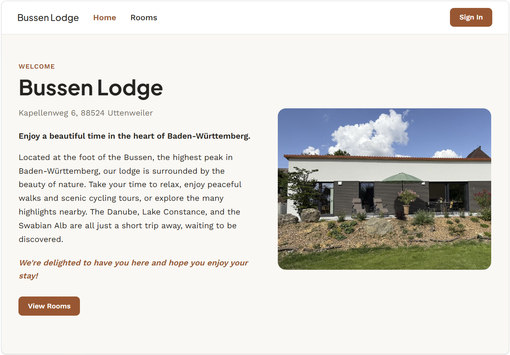
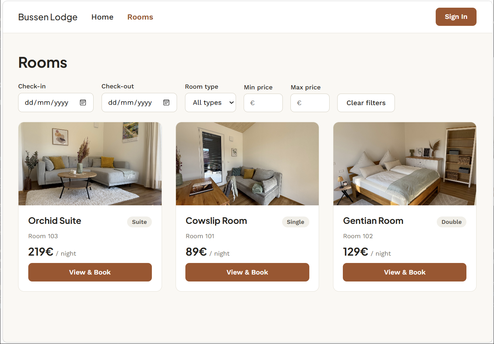
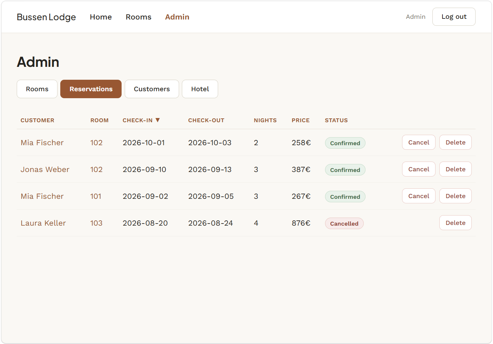

# Hotel Reservation System

[](https://github.com/mluib/hotel-reservation-system/actions/workflows/ci.yml)

A full-stack hotel reservation system — ASP.NET Core backend, Angular frontend, Dockerized, tested, with CI — built with the assistance of GitHub Copilot, Claude Code, and Claude Design, as a portfolio project demonstrating real software engineering ability alongside disciplined, directed AI-assisted development.

<p>
  
  
</p>
<p align="center">
  
</p>

**Frontend pages:** home · rooms (browse & filter by type, price, availability) · booking · sign up / log in · a customer's own reservations · an admin console (rooms, reservations, customers, hotel — full CRUD, photo uploads) · a dedicated screen when the backend is unreachable.

## Goals

- **Backend** — Clean Architecture, DDD-inspired modeling, three-tier automated tests, JWT auth. Every architecture decision is the developer's own; AI assisted with the implementation, and every generated change is reviewed, corrected, or rejected before being accepted — never because it merely compiled. See [`docs/architecture-overview.md`](docs/architecture-overview.md).
- **Frontend** — the one deliberate exception: implemented end-to-end, agentically, by Claude Code, using multiple AI tools the developer combined (Claude Code for the wireframe, Claude Design for the mockup built on it, Claude Code again for the build). AI wrote the code; the developer made every decision about what it should do first.
- **DevOps** — Docker, docker-compose, and CI: every technical decision is the developer's, who personally ran, tested, and debugged the real problems along the way — deliberately asking for a teaching-first plan rather than a done-for-you one. See [`docs/decisions.md`](docs/decisions.md).
- **AI-assisted development** — nothing is committed unreviewed; the complete, dated trail of notable prompts, decisions, and corrections is public ([`docs/workflow-log.md`](docs/workflow-log.md)). See [`docs/ai-assisted-development.md`](docs/ai-assisted-development.md).

## Tech stack

### Backend

| Area | Details |
|---|---|
| REST API | ASP.NET Core Web API (.NET 10) — CRUD endpoints (e.g. `ReservationsController`), DTOs at the boundary (e.g. `CreateReservationRequest`) |
| Clean Architecture | Api → Infrastructure → Application → Domain, dependencies point inward only. DI via `AddScoped<>` + constructor injection. Repository pattern (e.g. `IReservationRepository`) |
| Validation | API (Data Annotations) · Application (e.g. room availability) · Domain (e.g. valid check-in/check-out, enforced by the `DateRange` value object) |
| Persistence | EF Core, Code First, migrations, Fluent API entity configurations, SQL Server |
| DDD-inspired modeling | Invariant-protecting entities, value objects (`EmailAddress`, `Money`, `DateRange`), repository abstraction, independent aggregates (`Room`, `Customer`, `Reservation`) |
| SOLID | SRP (Controller / Use Case / Entity / Repository), OCP/LSP/DIP (via repository interfaces), ISP (small, per-entity interfaces) |
| Security | ASP.NET Core Identity, JWT Bearer Authentication, role-based authorization, ownership checks in the use case layer |
| Testing | xUnit + FluentAssertions across all three tiers, Moq for Application tests, `WebApplicationFactory` + SQLite in-memory for Integration tests — ~66 tests |
| API docs | OpenAPI/Swagger, XML doc comments surfaced straight from the source code (`IncludeXmlComments`), `[ProducesResponseType]` |
| Logging & errors | Serilog (structured request + event logs), global exception handling (`ExceptionHandlingMiddleware`), `ProblemDetails` (RFC 7807) |

### Frontend

| Area | Details |
|---|---|
| Design | Wireframes (Claude Code artifacts) → mockup (Claude Design) |
| Framework | Angular, standalone components, signals — no NgRx |
| Implementation | Fully agentic (Claude Code: planning + code), built under the developer's decisions and the approved mockup |
| Structure | `core/` (auth, models, HTTP services), `shared/` (dialogs), `layout/` (nav), `features/` (one folder per screen) — see [`docs/architecture-overview.md`](docs/architecture-overview.md) |
| Resilience | Health check + HTTP interceptor detect an unreachable backend and show a dedicated status screen instead of a broken app |

### DevOps

| Area | Details |
|---|---|
| Docker | Multi-stage builds — [`backend/Dockerfile`](backend/Dockerfile) (SDK → ASP.NET runtime), [`frontend/Dockerfile`](frontend/Dockerfile) (Node → nginx) |
| docker-compose | Full stack incl. SQL Server, auto-migration + dev seed on startup — [`docker-compose.yml`](docker-compose.yml), [`.env`](.env) |
| CI | GitHub Actions — build+test backend, build+lint frontend, on every push/PR to `main` — [`.github/workflows/ci.yml`](.github/workflows/ci.yml) |
| Secrets | Committed demo-only [`.env`](.env) for docker-compose, `dotnet user-secrets` for native dev — see [`docs/decisions.md`](docs/decisions.md) |

## Running with Docker

```bash
docker compose up -d --build
```

- The least-effort way to see it working — zero setup, no local .NET/Node/SQL Server install needed
- Frontend: http://localhost:4200
- Backend / Swagger: http://localhost:5044/swagger
- A demo hotel with three rooms (one per type) and placeholder photos, plus an admin login (`admin@hotel.local` / `Admin123!`), are seeded automatically on first run
- Needs ports `4200`, `5044`, and `14330` free on the host — startup fails for whichever service's port is already taken (e.g. a native dev server already running there); `14330` (not SQL Server's default `1433`) is deliberate, since a locally-installed SQL Server commonly already holds that one

```bash
docker compose logs -f   # tail logs
docker compose down      # stop (add -v to also clear the database volume)
```

See [`docs/running.md`](docs/running.md) for other ways to run this (Docker standalone or natively in Visual Studio/VS Code).

## Documentation

| File | Contents |
|---|---|
| [`docs/architecture-overview.md`](docs/architecture-overview.md) | Layers, request flow, auth flow, domain model, testing, frontend, DevOps |
| [`docs/decisions.md`](docs/decisions.md) | Why things are built the way they are, including rejected alternatives |
| [`docs/ai-assisted-development.md`](docs/ai-assisted-development.md) | Tool-by-tool attribution, methodology, concrete review/correction examples |
| [`docs/workflow-log.md`](docs/workflow-log.md) | The complete, dated log of every notable prompt, decision, and correction |
| [`docs/roadmap.md`](docs/roadmap.md) | Phase-by-phase project plan |
| [`docs/running.md`](docs/running.md) | Every way to run the stack, in detail |
| [`docs/raw-ai-logs/`](docs/raw-ai-logs/) | Frozen original AI chat exports and design artifacts |

## License

MIT — see [`LICENSE`](LICENSE).

## Author

Manuel Luibrand
